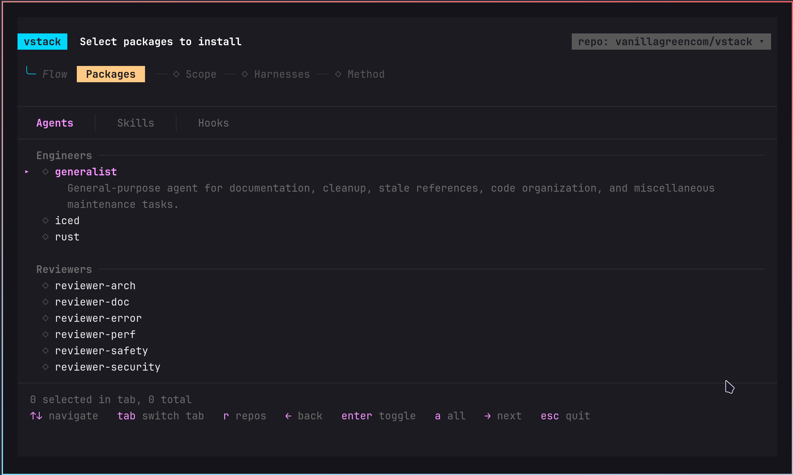

# vstack

Cross-harness package manager for AI coding systems.

Write a package once as a harness-agnostic skill, agent, or hook, then install it into Claude Code, Cursor, OpenCode, or Codex through one Rust CLI.

[](./cli/Cargo.toml)
[](https://ratatui.rs)
[](#supported-harnesses)
[](#supported-harnesses)
[](#supported-harnesses)
[](#supported-harnesses)



---

## What Is vstack?

`vstack` is two things:

1. A Rust CLI and TUI for discovering, selecting, installing, updating, and removing AI coding packages.
2. A maintained package catalog in this repo containing reusable agents, skills, and hooks.

The key idea is simple:

- Packages are authored once in canonical, harness-agnostic formats.
- `vstack` translates them into each harness's native representation at install time.
- Repos can be swapped. The built-in catalog is just the default source, not the only one.

This makes `vstack` closer to a package manager than a static dotfiles repo.

## Features

- Cross-harness install flow: Claude Code, Cursor, OpenCode, and Codex from one CLI.
- Package source switching: install from this repo or another compatible repo.
- Global and project scope: install once per user, or per project.
- Skill dependency resolution: skills can declare required and optional dependencies in `SKILL.md`; required dependencies are auto-included transitively during install.
- Config-driven attribution: `vstack.toml` maps extra skills to agents, role-wide skills to agent roles, and hook events to the roles that should receive them.
- Reconciliation: installed agents regenerate when skills/hooks change.
- Source registry: previously used package repos are remembered and reusable from the TUI.
- Safe defaults: project-only harnesses are blocked or skipped appropriately in global mode.
- Fast terminal UX: native Rust app built with `ratatui` and `crossterm`.

## Quick Start

```bash
# Install the CLI
cargo install --git https://github.com/vanillagreencom/vstack.git vstack

# Open the interactive installer with the default package catalog
vstack add vanillagreencom/vstack
```

Useful commands:

```bash
# Interactive install
vstack add vanillagreencom/vstack

# Install from the current repo if you're inside a package source
vstack add

# Install all packages to all detected harnesses
vstack add vanillagreencom/vstack --all

# Global install
vstack add vanillagreencom/vstack --all --global

# Install specific skills to specific harnesses
vstack add vanillagreencom/vstack --skill rust-safety,perf-zero-alloc --agent claude-code -y

# Inspect / remove
vstack list
vstack check
vstack remove rust-safety
```

## How It Works

### Mental Model

`vstack` treats a source repo as a package registry:

- `agents/*.md`: canonical agent definitions
- `skills/*/SKILL.md`: canonical skills, rules, scripts, workflows
- `hooks/*.sh`: canonical safety hooks
- `vstack.toml`: mapping and attribution rules

At install time, the CLI discovers those packages, lets the user choose what to install, then emits harness-specific files in the correct destination.

### Dependencies And Mapping

Package dependencies are currently skill-to-skill dependencies. A skill can declare them in `SKILL.md` frontmatter:

```yaml
dependencies:
  required: [linear, orchestration, decider]
  optional: [benchmarking, visual-qa]
```

`vstack` builds a dependency graph from installed skills and auto-adds only `required` dependencies. `optional` dependencies are preserved as metadata/documentation, but are not auto-installed.

`vstack.toml` is the source repo's mapping layer. The CLI reads it at install time to decide which agents should receive extra skills beyond prefix matching, which skills should be attached to all agents of a role, and which hook event/matcher combinations should apply to which roles.

```toml
[agent-skills]
iced = ["iced-rs", "visual-qa"]

[role-skills]
engineer = ["issue-lifecycle", "github", "worktree"]

[hook-events]
"PreToolUse:Bash" = "all"
"PostToolUse:Edit|Write" = ["engineer"]
```

### Architecture

```text
source repo
├─ agents/*.md
├─ skills/*/SKILL.md
├─ hooks/*.sh
└─ vstack.toml
        │
        ▼
   vstack CLI / TUI
   - discovers packages
   - resolves dependencies
   - selects repo / scope / harnesses / method
   - applies mapping rules
        │
        ├─ Claude Code → .claude/agents, .claude/skills, .claude/hooks, settings.json
        ├─ Cursor      → .cursor/rules
        ├─ OpenCode    → .opencode/agents, .opencode/skills, opencode.json
        └─ Codex       → .codex/agents, .agents/skills
```

### Repo Sources

The default source is this repo: `vanillagreencom/vstack`.

The TUI also supports:

- switching between remembered package repos
- adding a new package repo by GitHub shorthand or URL
- persisting known sources in a small registry under vstack's global state

Compatible repos follow the same content model:

```text
agents/
skills/
hooks/
vstack.toml
```

## Supported Harnesses

| Harness | Agents | Skills | Hooks | Notes |
|---|---|---|---|---|
| Claude Code | `.claude/agents/*.md` | `.claude/skills/<name>/` | native `.claude/hooks/*.sh` + `settings.json` | richest native hook support |
| Cursor | `.cursor/rules/*.mdc` | `.cursor/rules/<name>/` | safety rules only | project scope only |
| OpenCode | `.opencode/agents/*.md` | `.opencode/skills/<name>/` | instructions + `opencode.json` permissions | config-dir aware |
| Codex | `.codex/agents/*.toml` | `.agents/skills/<name>/` | safety prose in `developer_instructions` | uses `CODEX_HOME` when set |

Global install behavior:

- Claude Code: user home `~/.claude`
- OpenCode: config-dir based, respecting `OPENCODE_CONFIG` / `OPENCODE_CONFIG_DIR`
- Codex: `CODEX_HOME` or `~/.codex`
- Cursor: intentionally project-only

Windows note:

- The CLI should run natively.
- “Symlink” mode falls back to copy on non-Unix targets.

## Package Catalog In This Repo

### Agents

| Agent | Role | Brief |
|---|---|---|
| `generalist` | engineer | General maintenance, cleanup, docs, stale references, and project hygiene. |
| `iced` | engineer | Iced UI implementation and architecture specialist. |
| `rust` | engineer | Rust engineer for systems work, performance, zero-allocation, and low-level design. |
| `tpm` | manager | Technical program management and roadmap analysis agent. |
| `reviewer-arch` | reviewer | Reviews boundaries, abstractions, and architectural drift. |
| `reviewer-doc` | reviewer | Reviews documentation accuracy and stale docs. |
| `reviewer-error` | reviewer | Reviews error handling, silent failures, and propagation. |
| `reviewer-perf` | reviewer | Reviews latency, benchmarks, and performance regressions. |
| `reviewer-safety` | reviewer | Reviews unsafe Rust, memory safety, and concurrency correctness. |
| `reviewer-security` | reviewer | Reviews auth, input handling, and security risks. |
| `reviewer-structure` | reviewer | Reviews modularity, file size, and code organization. |
| `reviewer-test` | reviewer | Reviews test coverage, missing cases, and test quality. |

### Skills

#### Rust

| Skill | Brief |
|---|---|
| `rust-arch` | Rust architecture rules, anti-patterns, and review heuristics. |
| `rust-async` | Async internals, runtime patterns, cancellation, and concurrency composition. |
| `rust-cargo` | Cargo workflows, workspaces, feature flags, and build/release config. |
| `rust-conventions` | Style, layout, tests, and definition-of-done conventions. |
| `rust-cross` | Cross-compilation, target setup, and multi-platform builds. |
| `rust-debugging` | GDB/LLDB, tracing, panic triage, and async runtime debugging. |
| `rust-ffi` | Safe C interop and FFI wrapper patterns. |
| `rust-no-std` | `no_std` design, alloc boundaries, and embedded-friendly structure. |
| `rust-safety` | Unsafe code review, SAFETY comments, and safety audit patterns. |

#### Performance

| Skill | Brief |
|---|---|
| `perf-cache` | Cache locality, false sharing, and data layout optimization. |
| `perf-ebpf` | Aya/eBPF instrumentation and kernel-level observability. |
| `perf-latency` | Benchmarking and percentile-focused latency measurement. |
| `perf-lock-free` | Atomics, loom verification, and lock-free correctness. |
| `perf-profiling` | Flamegraphs, hotspot analysis, NUMA, and jitter investigation. |
| `perf-simd` | SIMD, auto-vectorization, intrinsics, and runtime dispatch. |
| `perf-threading` | Pinning, topology-aware concurrency, and jitter reduction. |
| `perf-zero-alloc` | Eliminating allocations in hot paths. |

#### UI / Domain

| Skill | Brief |
|---|---|
| `iced-rs` | Iced 0.14 patterns, reactive UI rules, and Elm-style structure. |
| `price-handling` | Price rounding, epsilon comparison, and market-price handling. |
| `trading-design` | Dense, professional trading-style interface design guidance. |
| `visual-qa` | Screenshot testing, visual baselines, OCR targeting, and UI verification. |

#### Workflow / Platform (WIP)

These packages are still WIP. They were migrated from a specific project and have not been tested as thoroughly in the generalized `vstack` setup yet. GitHub issues are welcome.

| Skill | Brief |
|---|---|
| `benchmarking` | Benchmark recording, baselines, and regression detection workflows. |
| `decider` | Architectural decision document management and indexing. |
| `github` | GitHub PR, thread, review, CI, and merge workflows. |
| `issue-lifecycle` | Delegated implementation/review/QA issue workflows. |
| `linear` | Linear issue, cycle, milestone, and project workflows with fully custom API scripts. |
| `orchestration` | Multi-agent session coordination and workflow state management. |
| `project-management` | TPM planning flows for cycles, prioritization, and roadmaps. |
| `worktree` | Git worktree creation, env/config linkage, and isolated workflows. |

### Hooks

| Hook | Event | Brief |
|---|---|---|
| `block-bare-cd` | `PreToolUse` | Blocks unsafe bare `cd` usage and nudges toward subshell-safe patterns. |
| `pre-commit-check` | `PreToolUse` | Validates formatting and lint before commits. |
| `post-edit-lint` | `PostToolUse` | Runs lint checks after source edits. |
| `post-commit-lsp-warn` | `PostToolUse` | Warns about stale LSP diagnostics after commits. |
| `post-compact-lsp-warn` | `PostCompact` | Warns about stale diagnostics after context compaction. |
| `task-completed-check` | `TaskCompleted` | Runs final lint checks before marking work complete. |

## License

MIT
